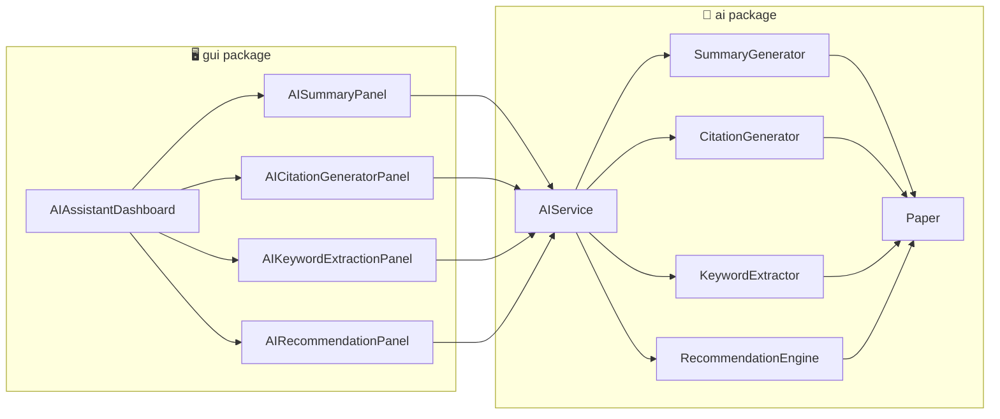

# User Authentication & Profile Module
### Member 1 — AI Powered Research Paper Organizer

This folder contains the **complete, working code for Member 1's part only**:
Login, Registration, User Profile, Change Password, Logout.

---

## 📁 Folder Structure

```
AuthModule/
├── src/
│   ├── Main.java                  # run this to launch the module
│   ├── model/
│   │   └── User.java              # data class (fields + getters/setters)
│   ├── controller/
│   │   ├── LoginController.java   # login logic + session (currentUser)
│   │   ├── RegisterController.java# registration validation + save
│   │   └── UserProfile.java       # edit profile / change password / logout
│   ├── gui/
│   │   ├── LoginForm.java         # Login Form (1280x720)
│   │   ├── RegisterForm.java      # Register Form (1280x720)
│   │   └── ProfileForm.java       # Profile Form (1280x720)
│   └── util/
│       ├── FileDatabase.java      # simple file-based storage (users.dat)
│       └── PasswordUtil.java      # SHA-256 password hashing
└── resources/
    └── logo.png                  # your brain/AI icon, used in all 3 windows
```

This maps 1-to-1 to what your project plan asked for:
- **Modules:** Login, Registration, User Profile, Change Password, Logout → covered by `LoginController`, `RegisterController`, `UserProfile`.
- **GUI:** Login Form, Register Form, Profile Form → `LoginForm.java`, `RegisterForm.java`, `ProfileForm.java`.
- **Classes:** User, LoginController, RegisterController, UserProfile → all present with those exact names.

---

## ▶️ How to run

### Option A — IntelliJ IDEA / Eclipse / VS Code (recommended)
1. Open the `AuthModule` folder as a new Java project.
2. Mark `src` as the "Sources Root" (IntelliJ does this automatically).
3. Make sure `resources/logo.png` stays in the project's **root working directory**
   (same level as where you run the program from) — the code loads it with the
   relative path `"resources/logo.png"`.
4. Run `Main.java`.

### Option B — Terminal (javac/java)
```bash
cd AuthModule
javac -d out $(find src -name "*.java")
java -cp out Main
```
(Run this from inside the `AuthModule` folder so it can find `resources/logo.png`
and so it can create `users.dat` in the same place.)

---

## 🧠 How it works (explanation for your viva / GitHub description)

1. **User.java** — just a data holder (`userId, fullName, email, username,
   passwordHash, institution, bio, joinDate`). It never contains logic — that's
   the MVC principle: Model = data only.

2. **FileDatabase.java** — because your team may not have set up the shared
   database yet, this class stores all users inside a file called `users.dat`
   using Java's built-in object serialization. It exposes clean methods
   (`addUser`, `findByUsername`, `updateUser`...) so that later, when
   Member 5's `DatabaseManager` (real MySQL/SQLite) is ready, you can literally
   just swap the *inside* of these methods — nothing in your controllers or
   GUI needs to change.

3. **PasswordUtil.java** — turns the typed password into a SHA-256 hash before
   it's ever saved, so raw passwords are never stored on disk.

4. **RegisterController.java** — validates the form (empty fields, valid
   email format, password length, matching confirm-password, duplicate
   username/email) and, if everything passes, creates a new `User` and saves
   it via `FileDatabase`.

5. **LoginController.java** — looks up the username, checks the password hash,
   and if correct, stores that `User` as `currentUser` (a static "session").
   Every other screen (like ProfileForm) asks `LoginController.getCurrentUser()`
   to know who is logged in.

6. **UserProfile.java** — handles what a *logged-in* user can do afterward:
   edit name/institution/bio, change password (requires the correct old
   password first), and logout (just clears the session).

7. **GUI (LoginForm / RegisterForm / ProfileForm)** — all three are plain
   `JFrame`s fixed at **1280x720**, dark-themed, and show your brain logo
   (`resources/logo.png`) both as the window icon (taskbar) and as a banner
   image inside the card. They call the controllers above and only display
   success/error messages — no data logic lives inside the GUI classes.

**Flow:** `Main` → `LoginForm` → (register link) → `RegisterForm` → back to
`LoginForm` → successful login → `ProfileForm` → logout → back to `LoginForm`.

---

## 📤 Uploading to GitHub

```bash
cd AuthModule
git init
git add .
git commit -m "Member 1: User Authentication & Profile module"
git branch -M main
git remote add origin <your-repo-url>
git push -u origin main
```

If this is being merged into the team's shared repository, just copy the
`src/model`, `src/controller`, `src/gui`, and `src/util` folders (and
`resources/logo.png`) into the shared project's matching folders, and make
sure package names (`model`, `controller`, `gui`, `util`) don't collide with
teammates' classes — if they do, ask the team to agree on one shared package
structure before merging.

---

## ⚠️ Notes for the demo
- `users.dat` will be created automatically the first time someone registers —
  don't worry if it's not in the repo yet, add it to `.gitignore` since it's
  runtime data, not source code.
- Password rule: minimum 6 characters. Username rule: minimum 4 characters.
- This uses no external libraries — pure Java + Java Swing, so it will run on
  any machine with JDK 8+ installed.
#          Member 2
# 📚 Research Paper Management System

A Java Swing desktop application for managing research papers through a simple graphical interface. The system supports adding, editing, deleting, viewing, and opening research-paper PDFs, with optional application-level password protection for PDFs.

## ✨ Features

* ➕ **Add Paper** — add a research paper with title, authors, published year, venue, keywords, abstract, and PDF.
* ✏️ **Edit Paper** — update existing paper information and optionally replace its PDF.
* 🗑️ **Delete Paper** — remove a paper and its stored PDF from the application repository.
* 👁️ **View Paper Details** — view metadata, PDF information, dates, and abstract.
* 📄 **Open PDF** — open the stored PDF from the application.
* 🔐 **Optional PDF Password Protection** — protect a paper at the application level with a password.
* 🔑 **Password Hashing** — passwords are stored as SHA-256 hashes rather than plain text.
* 💾 **Persistent Storage** — paper records are serialized to a local `.dat` file so changes survive application restarts.
* 📁 **Local PDF Repository** — uploaded PDFs are copied into the application's local repository.
* 🎨 **Colorful Swing GUI** — blue-themed interface with cards, action buttons, PDF indicators, and responsive hover effects.

## 🧩 Research Paper Management Module

This project implements the Research Paper Management module with the following main classes and forms:

### Core Classes

| Class             | Responsibility                                                                                |
| ----------------- | --------------------------------------------------------------------------------------------- |
| `Paper`           | Represents a research paper and stores its metadata, PDF path, dates, and password hash.      |
| `PaperManager`    | Handles paper storage, IDs, PDF repository operations, loading/saving, editing, and deletion. |
| `PaperController` | Connects the GUI with the manager and handles validation, password hashing, and PDF opening.  |

### GUI Forms

| Form               | Purpose                                                                        |
| ------------------ | ------------------------------------------------------------------------------ |
| `PaperListForm`    | Main dashboard showing the paper list and actions.                             |
| `UploadPaperForm`  | Add or edit paper information and select a PDF.                                |
| `PaperDetailsForm` | Displays complete information about a selected paper and provides PDF opening. |

## 🖥️ Main Interface


The main Paper List interface provides:

* Paper ID
* Title
* Authors
* Published Year
* Venue
* Action controls
* Total paper count
* **Add New Paper** button

Each paper provides actions for:


* **View** — opens the paper details window.
* **Edit** — opens the paper editing form.
* **Delete** — removes the selected paper after confirmation.
* **Open PDF** — opens the stored PDF and requests the application password when protection is enabled.

## 🔐 PDF Password Protection


Password protection is **optional**.


When adding a paper, the user can enable:

> **Protect PDF with password**
> 


If enabled, the password must be entered and confirmed.

When editing an already protected paper:

* Leaving the password fields blank keeps the existing password.
* Entering a new password changes the password.
* Disabling protection removes the application-level password requirement.

The application stores a **SHA-256 password hash**, not the plain-text password.

> **Note:** This is application-level protection. The program asks for the password before opening the PDF; it does not modify the PDF's own encryption/password settings.

## 💾 Data Persistence

The application uses local serialized Java data storage.


```text
paper_data/
├── papers.dat
└── repository/
    ├── paper_1_example.pdf
    ├── paper_2_example.pdf
    └── ...
```

### `papers.dat`

Stores the serialized list of `Paper` objects, including their metadata, PDF path, dates, and password hash.

### `repository/`

Stores copies of uploaded PDF files. The application copies the selected PDF into this directory rather than relying only on the original external file location.

The data directory is created automatically when `PaperManager` starts.

## 🏗️ Application Flow

```text
                  Main.java
                      │
                      ▼
              PaperListForm
                      │
                      ▼
              PaperController
                      │
                      ▼
               PaperManager
                 /         \
                ▼           ▼
          papers.dat     repository/
                            │
                            ▼
                         PDF files
```

### Add Paper

```text
UploadPaperForm
      ↓
PaperController
      ↓
Validate information
      ↓
Hash password (if enabled)
      ↓
PaperManager
      ↓
Copy PDF to repository
      ↓
Save papers.dat
```

### Edit Paper

```text
PaperListForm
      ↓
UploadPaperForm
      ↓
PaperController
      ↓
PaperManager
      ↓
Update Paper object
      ↓
Save papers.dat
```

### Delete Paper

```text
PaperListForm
      ↓
Confirm deletion
      ↓
PaperController
      ↓
PaperManager
      ↓
Delete stored PDF
      ↓
Remove Paper
      ↓
Save papers.dat
```

### Open PDF

```text
PaperListForm / PaperDetailsForm
              ↓
       PaperController
              ↓
      Check PDF existence
              ↓
     Password protected?
        /            \
      No              Yes
      ↓                ↓
 Open PDF       Ask for password
                       ↓
                Verify SHA-256 hash
                       ↓
                   Open PDF
```

## 🛠️ Technologies Used

* **Java**
* **Java Swing** — desktop GUI
* **Java Serialization** — local paper-data persistence
* **Java NIO / File API** — PDF file and repository management
* **SHA-256** — application-level password hashing
* **NetBeans IDE** — development environment

## 📂 Project Structure

```text
Research Paper Management System/
│
├── Main.java
├── Paper.java
├── PaperController.java
├── PaperManager.java
├── PaperListForm.java
├── PaperDetailsForm.java
└── UploadPaperForm.java
```

At runtime, the application creates:

```text
paper_data/
├── papers.dat
└── repository/
```

## 📋 Paper Information

Each `Paper` object can contain:

* ID
* Title
* Author(s)
* Published Year
* Venue/Category
* Keywords
* Abstract
* PDF Path
* Date Added
* Last Updated
* Optional PDF Password Hash

## 🆔 Paper IDs

The application maintains an internal unique ID for each paper. New papers receive the next available ID. Deleted IDs are not reused automatically, which helps preserve stable references for Edit, Delete, View, and PDF operations.

The displayed table serial number can be treated separately from the internal paper ID if a sequential `1, 2, 3...` display is desired.

## 🎯 Project Objectives

* Provide a centralized desktop interface for organizing research papers.
* Make paper metadata easy to add, edit, view, and manage.
* Keep uploaded PDFs inside a local application repository.
* Preserve paper information between application sessions.
* Provide optional application-level protection for sensitive PDFs.
* Apply Object-Oriented Programming concepts through a modular Java design.

## 🔮 Future Improvements

Possible future extensions include:

* 🔎 Paper search and filtering
* 🏷️ Advanced keyword/tag management
* 📊 Research statistics and dashboards
* 🗃️ Category-based organization
* ☁️ Cloud backup/synchronization
* 👥 Multi-user authentication
* 📥 Import/export functionality
* 📝 Rich abstract and notes management

## 👨‍💻 Module Contribution

**Member 2(Md Azimul Islam Sarker-377) — Research Paper Management**

Responsible for the paper-management functionality, including:

* Paper data model
* Paper management logic
* Paper controller
* Add Paper interface
* Edit Paper interface
* Delete Paper functionality
* Paper Details interface
* PDF opening
* Local paper persistence
* Optional PDF password protection

##


# AI Powered Research Paper Organizer - Member 3 Part

This is my part of our group project. My module is Search & Organization.

Group Project: AI Powered Research Paper Organizer
My Role: Member 3 - Search & Organization

## What I built

- Search Papers - search papers by title or author
- Filter - filter by Author, Year, Category
- Categories - browse papers by category
- Bookmark / Favorite - mark papers as favorite
- Recent Papers - shows recently opened papers

## Files

src/model - Paper.java, Category.java
src/manager - SearchManager.java, FavoriteManager.java
src/gui - SearchForm.java, CategoryForm.java, FavoriteForm.java, MainApp.java
src/util - SampleData.java (dummy/sample papers for testing my part alone)
logo.png - project logo used in the window

## How to run

Using command line:
```
cd ResearchPaperOrganizer
javac -d bin -cp src src/model/*.java src/manager/*.java src/util/*.java src/gui/*.java
cp logo.png bin/
java -cp bin gui.MainApp
```

Or open in NetBeans / Eclipse / IntelliJ:
1. Create a new Java project
2. Copy model, manager, gui, util folders inside src
3. Put logo.png in the source folder
4. Run gui.MainApp

Window size is fixed to 1280x720.

## Note

Right now this runs with sample/dummy data (SampleData.java) so I could test my part alone without waiting for the whole team's code. When we merge everyone's code together, this will connect with Member 2's real Paper class and data instead of the sample data.

The three panels (SearchForm, CategoryForm, FavoriteForm) are just JPanels, so they can be added as tabs inside the team's main combined window later.


# 🤖 AI Features Module
### Member 4 — AI Powered Research Paper Organizer

*Summarize, extract, cite, and discover research papers — powered by smart, explainable algorithms.*


</div>

---

## 📑 Table of Contents

- [Overview](#-overview)
- [Features](#-features)
- [Architecture](#️-architecture)
- [GUI Components](#️-gui-components)
- [Core Classes](#-core-classes-logic-layer)
- [Design System](#-design-system)
- [Integration Guide](#-integration-guide-for-teammates)
- [How to Run](#️-how-to-run)
- [Example Usage](#-example-usage)
- [Limitations & Roadmap](#️-limitations--roadmap)
- [Tech Stack](#️-tech-stack)
- [Author](#-author)

---

## 📖 Overview

The **AI Features module** is Member 4's contribution to the **AI Powered Research Paper Organizer** — a Java desktop application that helps researchers manage, understand, and cite academic papers faster.

This module answers one core question: *"I have a research paper — what can AI-style tools help me do with it in seconds?"*

> 💡 All algorithms here are intentionally **simple, transparent, and explainable** (frequency counts, keyword overlap, template formatting) rather than opaque ML black-boxes — ideal for an academic OOP project where the logic must be understandable and demonstrable.

---

## ✨ Features

<table>
<tr>
<td width="50%" valign="top">

### 📄 AI Summary
Paste any paper's text and instantly get a short **extractive summary** — the most relevant opening sentences, pulled automatically.

</td>
<td width="50%" valign="top">

### 🏷️ Keyword Extraction
Automatically surfaces the **most frequent, meaningful terms** in a paper, filtering out common stopwords — adjustable from 3 to 10 keywords.

</td>
</tr>
<tr>
<td width="50%" valign="top">

### 📝 Citation Generator
Fill in Author, Title, Year, and Journal — get a correctly formatted **APA** or **IEEE** citation instantly, ready to copy.

</td>
<td width="50%" valign="top">

### 🔗 Paper Recommendation
Select a paper and discover **related papers**, ranked by a keyword-overlap **match percentage**.

</td>
</tr>
</table>

---

## 🏗️ Architecture



**Design principle:** GUI panels never call the generator/extractor classes directly — everything routes through `AIService`, the single point of contact for the rest of the team's codebase.

---

## 🖥️ GUI Components

| Screen | File | Accent Color |
|---|---|:---:|
| 🏠 AI Assistant Dashboard *(main window, sidebar navigation)* | `AIAssistantDashboard.java` | 🔵 Navy |
| 📄 Summary Panel | `AISummaryPanel.java` | 🟣 Purple |
| 📝 Citation Panel | `AICitationGeneratorPanel.java` | 🟢 Teal |
| 🏷️ Keyword Extraction Panel | `AIKeywordExtractionPanel.java` | 🟠 Coral |
| 🔗 Recommendation Panel | `AIRecommendationPanel.java` | 🩷 Pink |

All panels live inside the Dashboard's `CardLayout`, so users switch features from one sidebar without opening separate windows.

---

## 🧠 Core Classes (Logic Layer)

| Class | Responsibility |
|---|---|
| `Paper` | Data model for a research paper — title, author, year, journal, content |
| `SummaryGenerator` | Extractive summarization (first N sentences) |
| `KeywordExtractor` | Frequency-based keyword extraction with stopword filtering |
| `CitationGenerator` | APA / IEEE citation string formatting |
| `RecommendationEngine` | Keyword-overlap similarity scoring between papers |
| `AIService` | 🔑 **Facade** — the single entry point the rest of the app should use |

<details>
<summary>📂 Package structure</summary>

```
src/main/java/
└── com/mycompany/
    ├── ai/
    │   ├── Paper.java
    │   ├── SummaryGenerator.java
    │   ├── CitationGenerator.java
    │   ├── KeywordExtractor.java
    │   ├── RecommendationEngine.java
    │   └── AIService.java
    └── gui/
        ├── AIAssistantDashboard.java
        ├── AISummaryPanel.java
        ├── AICitationGeneratorPanel.java
        ├── AIKeywordExtractionPanel.java
        └── AIRecommendationPanel.java
```

</details>

---

## 🎨 Design System

| Element | Style |
|---|---|
| Sidebar | Solid navy (`#0C447C`), white text |
| Header | Light blue, profile avatar top-right |
| Summary theme | Purple (`#534AB7`) |
| Citation theme | Teal (`#0F6E56`) |
| Keyword theme | Coral (`#993C1D`) |
| Recommendation theme | Pink (`#993556`) |

Each feature keeps a consistent accent color across its button, output panel, and sidebar icon — so users always know which tool they're in at a glance.

---

## 🔌 Integration Guide (for teammates)

> This section exists so any team member can plug their module into this one without reading through the full source.

- **🙋 Profile module owner:** `AIAssistantDashboard` exposes a public hook:
  ```java
  dashboard.setOnProfileClick(() -> {
      new ProfileFrame().setVisible(true); // your own window/panel
  });
  ```
  No need to touch this file — just call this method from your integration code.

- **📚 Paper Management module owner:** `AIRecommendationPanel` currently uses `createSampleData()` (4 placeholder papers). Replace this call with your real paper list once ready:
  ```java
  // Replace:
  allPapers = createSampleData();
  // With:
  allPapers = paperManagementService.getAllPapers();
  ```

- **📦 Shared `Paper` model:** If Paper Management already has its own `Paper` class, use that one instead — just make sure it exposes `getTitle()`, `getAuthor()`, `getYear()`, `getJournal()`, `getContent()`.

---

## ▶️ How to Run

```bash
1. Open the project in NetBeans
2. Navigate to: gui/AIAssistantDashboard.java
3. Right-click → Run File   (or press Shift + F6)
```

A window opens with the navy sidebar — click through Summary, Citation, Keyword Extraction, and Recommendation to test each feature.

---

## 🧪 Example Usage

<details>
<summary>📄 Summary — sample input/output</summary>

**Input:** *(pasted paper text, 200+ words)*
**Output:** First 3 sentences extracted as a concise summary.

</details>

<details>
<summary>📝 Citation — sample input/output</summary>

**Input:**
```
Author: J. Smith | Title: Deep Learning for NLP | Year: 2023 | Journal: IEEE Access
```

**APA:** `J. Smith (2023). Deep Learning for NLP. IEEE Access.`
**IEEE:** `[1] J. Smith, "Deep Learning for NLP," IEEE Access, 2023.`

</details>

<details>
<summary>🏷️ Keyword Extraction — sample output</summary>

`machine learning` `neural network` `deep learning` `data` `training`

</details>

---

## ⚠️ Limitations & Roadmap

This module intentionally uses **simple, explainable algorithms** appropriate for a 2nd-year OOP course — not production ML models.

| Current Approach | ✅ Done | 🚀 Future Upgrade |
|---|:---:|---|
| Extractive summarization (first N sentences) | ✅ | Abstractive summarization via NLP model |
| Frequency-based keywords | ✅ | TF-IDF or transformer-based extraction |
| Keyword-overlap recommendations | ✅ | Embedding/vector similarity |
| Manual citation field entry | ✅ | Auto metadata extraction from PDF |

---

## 🛠️ Tech Stack

| Layer | Technology |
|---|---|
| Language | Java |
| GUI | Java Swing |
| Build Tool | Maven |
| IDE | NetBeans |

---

<div align="center">

## 👤 Author

**Member 4** — AI Features Module
*Part of the AI Powered Research Paper Organizer team project*

</div>
