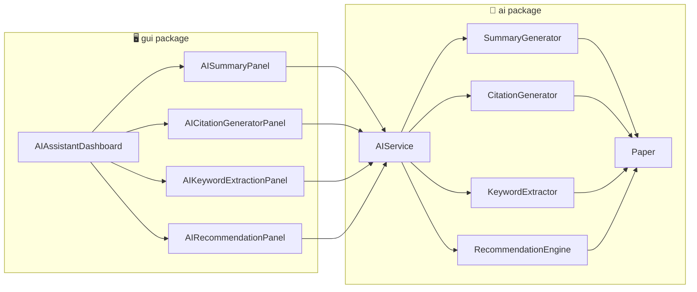

# User Authentication & Profile Module
### Member 1 — AI Powered Research Paper Organizer

This folder contains the **complete, working code for Member 1's part only**:
Login, Registration, User Profile, Change Password, Logout.

---

## 📁 Folder Structure

```
AuthModule/
├── src/
│   ├── Main.java                  # run this to launch the module
│   ├── model/
│   │   └── User.java              # data class (fields + getters/setters)
│   ├── controller/
│   │   ├── LoginController.java   # login logic + session (currentUser)
│   │   ├── RegisterController.java# registration validation + save
│   │   └── UserProfile.java       # edit profile / change password / logout
│   ├── gui/
│   │   ├── LoginForm.java         # Login Form (1280x720)
│   │   ├── RegisterForm.java      # Register Form (1280x720)
│   │   └── ProfileForm.java       # Profile Form (1280x720)
│   └── util/
│       ├── FileDatabase.java      # simple file-based storage (users.dat)
│       └── PasswordUtil.java      # SHA-256 password hashing
└── resources/
    └── logo.png                  # your brain/AI icon, used in all 3 windows
```

This maps 1-to-1 to what your project plan asked for:
- **Modules:** Login, Registration, User Profile, Change Password, Logout → covered by `LoginController`, `RegisterController`, `UserProfile`.
- **GUI:** Login Form, Register Form, Profile Form → `LoginForm.java`, `RegisterForm.java`, `ProfileForm.java`.
- **Classes:** User, LoginController, RegisterController, UserProfile → all present with those exact names.

---

## ▶️ How to run

### Option A — IntelliJ IDEA / Eclipse / VS Code (recommended)
1. Open the `AuthModule` folder as a new Java project.
2. Mark `src` as the "Sources Root" (IntelliJ does this automatically).
3. Make sure `resources/logo.png` stays in the project's **root working directory**
   (same level as where you run the program from) — the code loads it with the
   relative path `"resources/logo.png"`.
4. Run `Main.java`.

### Option B — Terminal (javac/java)
```bash
cd AuthModule
javac -d out $(find src -name "*.java")
java -cp out Main
```
(Run this from inside the `AuthModule` folder so it can find `resources/logo.png`
and so it can create `users.dat` in the same place.)

---

## 🧠 How it works (explanation for your viva / GitHub description)

1. **User.java** — just a data holder (`userId, fullName, email, username,
   passwordHash, institution, bio, joinDate`). It never contains logic — that's
   the MVC principle: Model = data only.

2. **FileDatabase.java** — because your team may not have set up the shared
   database yet, this class stores all users inside a file called `users.dat`
   using Java's built-in object serialization. It exposes clean methods
   (`addUser`, `findByUsername`, `updateUser`...) so that later, when
   Member 5's `DatabaseManager` (real MySQL/SQLite) is ready, you can literally
   just swap the *inside* of these methods — nothing in your controllers or
   GUI needs to change.

3. **PasswordUtil.java** — turns the typed password into a SHA-256 hash before
   it's ever saved, so raw passwords are never stored on disk.

4. **RegisterController.java** — validates the form (empty fields, valid
   email format, password length, matching confirm-password, duplicate
   username/email) and, if everything passes, creates a new `User` and saves
   it via `FileDatabase`.

5. **LoginController.java** — looks up the username, checks the password hash,
   and if correct, stores that `User` as `currentUser` (a static "session").
   Every other screen (like ProfileForm) asks `LoginController.getCurrentUser()`
   to know who is logged in.

6. **UserProfile.java** — handles what a *logged-in* user can do afterward:
   edit name/institution/bio, change password (requires the correct old
   password first), and logout (just clears the session).

7. **GUI (LoginForm / RegisterForm / ProfileForm)** — all three are plain
   `JFrame`s fixed at **1280x720**, dark-themed, and show your brain logo
   (`resources/logo.png`) both as the window icon (taskbar) and as a banner
   image inside the card. They call the controllers above and only display
   success/error messages — no data logic lives inside the GUI classes.

**Flow:** `Main` → `LoginForm` → (register link) → `RegisterForm` → back to
`LoginForm` → successful login → `ProfileForm` → logout → back to `LoginForm`.

---

## 📤 Uploading to GitHub

```bash
cd AuthModule
git init
git add .
git commit -m "Member 1: User Authentication & Profile module"
git branch -M main
git remote add origin <your-repo-url>
git push -u origin main
```

If this is being merged into the team's shared repository, just copy the
`src/model`, `src/controller`, `src/gui`, and `src/util` folders (and
`resources/logo.png`) into the shared project's matching folders, and make
sure package names (`model`, `controller`, `gui`, `util`) don't collide with
teammates' classes — if they do, ask the team to agree on one shared package
structure before merging.

---

## ⚠️ Notes for the demo
- `users.dat` will be created automatically the first time someone registers —
  don't worry if it's not in the repo yet, add it to `.gitignore` since it's
  runtime data, not source code.
- Password rule: minimum 6 characters. Username rule: minimum 4 characters.
- This uses no external libraries — pure Java + Java Swing, so it will run on
  any machine with JDK 8+ installed.


#         MEMBER 2

# AI-Powered Research Paper Organizer

## Research Paper Management Module

A Java-based module for managing research papers as part of the **AI-Powered Research Paper Organizer** CEP Mini Project for the Object-Oriented Programming Lab.

---

## 📌 Project Information

| Item           | Details                                |
| -------------- | -------------------------------------- |
| Project        | AI-Powered Research Paper Organizer    |
| Module         | Research Paper Management              |
| Course         | Object-Oriented Programming Lab        |
| Course Code    | CSE222                                 |
| Problem Domain | EdTech                                 |
| Technology     | Java                                   |
| GUI Framework  | Java Swing                             |
| Architecture   | Model – Manager – Controller – GUI     |
| Storage        | Local serialized data + PDF repository |

---

# 1. Module Overview

The **Research Paper Management Module** is responsible for creating, maintaining, viewing, and accessing research paper records.

The module provides five major functions:

* Add Paper
* Edit Paper
* Delete Paper
* View Paper Details
* Open PDF

The implementation uses Java Swing for the graphical user interface and separates the paper model, business/persistence logic, controller logic, and GUI components.

---

# 2. Main Features

## ➕ Add Paper

Users can create a new research paper record by providing:

* Title
* Author
* Year
* Venue/Category
* Abstract
* Optional PDF file

The system automatically assigns a unique ID and records the date on which the paper was added.

The `PaperManager` creates the paper object, stores it in the paper collection, and saves the updated data.

---

## ✏️ Edit Paper

Existing paper information can be modified.

The edit interface uses the same `UploadPaperForm` used for adding papers. When an existing `Paper` object is supplied, the form switches to edit mode and loads its existing information.

Users can modify:

* Title
* Author
* Year
* Venue
* Abstract
* PDF file

The existing PDF can remain unchanged if a new PDF is not selected.

---

## 🗑️ Delete Paper

Users can select a paper and delete it.

Before deletion, the system asks for confirmation:

> "Are you sure you want to delete this paper?"

If the paper has an associated PDF, the stored PDF is also removed from the repository before the paper record is deleted.

---

## 👁️ View Paper Details

The system provides a read-only details window for a selected paper.

The details include:

* Title
* Author
* Year
* Category/Venue
* Date Added
* PDF availability
* Abstract

The details are displayed using the `PaperDetailsForm` Swing dialog.

---

## 📄 Open PDF

Users can open the PDF associated with a paper.

Before opening the file, the controller checks:

1. Whether the paper exists
2. Whether a PDF is attached
3. Whether the PDF file exists
4. Whether the operating system supports opening the file

The application then uses Java's `Desktop` API to open the PDF using the system's default viewer.

---

# 3. System Architecture

The module follows a layered structure:

```text
                    User
                     │
                     ▼
              Java Swing GUI
                     │
                     ▼
             PaperController
                     │
                     ▼
              PaperManager
                     │
                     ▼
                  Paper
                     │
                     ▼
          Local Persistent Storage
```

### Layer Responsibilities

### Paper — Model

Represents a research paper and stores its information.

### PaperManager — Management/Persistence Layer

Responsible for:

* Creating papers
* Updating papers
* Deleting papers
* Finding papers
* Returning all papers
* Saving paper data
* Loading saved data
* Managing stored PDF files

### PaperController — Controller Layer

Responsible for:

* Receiving requests from GUI
* Validating user input
* Calling `PaperManager`
* Handling validation and I/O errors
* Managing PDF opening requests

The controller explicitly acts as the intermediary between GUI forms and `PaperManager`.

### GUI Layer

Provides the user interface through Java Swing.

---

# 4. Class Structure

## Paper

```text
Paper
--------------------------------
- id : int
- title : String
- author : String
- year : String
- category : String
- abstractText : String
- pdfPath : String
- dateAdded : String
--------------------------------
+ getId()
+ getTitle()
+ setTitle()
+ getAuthor()
+ setAuthor()
+ getYear()
+ setYear()
+ getCategory()
+ setCategory()
+ getAbstractText()
+ setAbstractText()
+ getPdfPath()
+ setPdfPath()
+ getDateAdded()
+ hasPdf()
+ toString()
```

The class implements `Serializable`, allowing paper objects to be stored and retrieved using Java object serialization.

---

# 5. Main Classes

## `Paper.java`

The model class representing a single research paper.

It contains the paper's identifying and descriptive information and provides getter/setter methods for appropriate attributes.

---

## `PaperManager.java`

Responsible for paper persistence and CRUD operations.

It maintains a collection of `Paper` objects using an `ArrayList`.

The class performs:

```text
addPaper()
editPaper()
deletePaper()
getPaperById()
getAllPapers()
```

It also manages local storage for paper records and PDF files.

---

## `PaperController.java`

Acts as the controller between the GUI and `PaperManager`.

Main operations include:

```text
addPaper()
editPaper()
deletePaper()
getPaperById()
getAllPapers()
openPdf()
```

## It also performs basic validation for required title and author fields.

## `PaperListForm.java`

The main application window.

It provides:

* Paper table
* Sidebar navigation
* Add Paper
* Edit Paper
* Delete Paper
* View Paper Details
* Open PDF
* Logout
* Paper count

The table displays:

```text
ID
Title
Authors
Published Year
Venue
Actions
```

---

## `UploadPaperForm.java`

This is an important part of the implementation.

Rather than having two separate Java classes for Add and Edit, the project uses **one reusable form** for both operations.

```text
UploadPaperForm
       │
       ├── existingPaper == null
       │       ↓
       │    Add Mode
       │
       └── existingPaper != null
               ↓
            Edit Mode
```

This reduces duplicated GUI code and demonstrates reusable design.

The form contains fields for title, author, year, venue, abstract, and PDF selection.

---

## `PaperDetailsForm.java`

Provides a read-only dialog for viewing the complete details of a selected paper.

---

## `Main.java`

The application entry point.

It initializes the system look and feel and launches the `PaperListForm` using Swing's event-dispatching mechanism.

---

# 6. Data Persistence

The application uses local file-based persistence.

```text
paper_data/
│
├── papers.dat
│
└── repository/
       ├── paper_1_....pdf
       ├── paper_2_....pdf
       └── ...
```

`papers.dat` stores serialized paper records.

The `repository` directory stores uploaded PDF files.

The manager creates these directories when the application starts.

---

# 7. PDF Management

When a PDF is uploaded, the system copies it into the application's repository folder.

The stored filename follows the pattern:

```text
paper_<id>_<original_filename>.pdf
```

Special characters in the original filename are replaced with underscores.

This allows the application to maintain a predictable local storage structure.

---

# 8. Input Validation

The controller validates the two required fields:

```text
Title
Author
```

If the title is empty:

```text
Title is required.
```

If the author is empty:

```text
Author is required.
```

The controller returns these messages to the GUI rather than directly displaying them, keeping validation logic separate from the interface.

---

# 9. Exception Handling

The module handles file-related errors using Java exception handling.

For example, failures during PDF storage are caught and converted into an error message:

```text
Failed to save PDF file: <error message>
```

## PDF opening failures are also handled without terminating the application.

# 10. OOP Concepts Demonstrated

## Encapsulation

The `Paper` attributes are declared private and accessed through public methods.

Example:

```java
private String title;

public String getTitle() {
    return title;
}

public void setTitle(String title) {
    this.title = title;
}
```

## This is a direct implementation of encapsulation.

## Abstraction

The GUI does not directly perform the persistence operations.

Instead:

```text
GUI
 ↓
Controller
 ↓
Manager
```

The user interface therefore does not need to know how paper data is serialized or how PDFs are copied to the repository.

---

## Composition / Object Association

`PaperController` contains a `PaperManager` instance:

```java
private final PaperManager manager;
```

This allows the controller to delegate paper-management operations to the manager.

---

## Serialization

The `Paper` class implements:

```java
Serializable
```

This allows paper objects to participate in Java object serialization for persistent storage.

---

# 11. GUI Design

The application uses Java Swing.

The main interface contains a dark sidebar and a central paper table.

Navigation includes:

```text
Paper List
Add Paper
Edit Paper
Delete Paper
View Paper Details
Open PDF
Logout
```

The interface also uses custom colors, buttons, vector icons, table styling, and a responsive layout based on Swing layout managers.

---

# 12. User Workflow

## Add Paper

```text
User
 ↓
Add Paper
 ↓
Enter Paper Information
 ↓
Choose PDF (Optional)
 ↓
Save
 ↓
PaperController
 ↓
Validate Input
 ↓
PaperManager
 ↓
Create Paper
 ↓
Save Paper Data
 ↓
Refresh Paper List
```

---

## Edit Paper

```text
User
 ↓
Select Paper
 ↓
Edit
 ↓
Existing Data Loaded
 ↓
Modify Information
 ↓
Save Changes
 ↓
PaperController
 ↓
PaperManager
 ↓
Update Paper
 ↓
Save Data
```

---

## Delete Paper

```text
User
 ↓
Select Paper
 ↓
Delete
 ↓
Confirmation
 ↓
PaperController
 ↓
PaperManager
 ↓
Delete PDF if applicable
 ↓
Delete Paper
 ↓
Save Data
```

---

## View Details

```text
User
 ↓
Select Paper
 ↓
View Details
 ↓
PaperController
 ↓
Retrieve Paper
 ↓
PaperDetailsForm
 ↓
Display Information
```

---

## Open PDF

```text
User
 ↓
Select Paper
 ↓
Open PDF
 ↓
Check Paper
 ↓
Check PDF
 ↓
Check File
 ↓
Desktop.open()
 ↓
System PDF Viewer
```

---

# 13. Testing

| Test Case                 | Expected Result                       |
| ------------------------- | ------------------------------------- |
| Add valid paper           | Paper is added                        |
| Add paper without title   | `Title is required.`                  |
| Add paper without author  | `Author is required.`                 |
| Edit existing paper       | Paper information is updated          |
| Edit nonexistent paper    | Appropriate error is returned         |
| Delete existing paper     | Paper is removed                      |
| Delete paper with PDF     | Paper and stored PDF are removed      |
| View paper                | Details dialog appears                |
| Open paper with valid PDF | PDF opens                             |
| Open paper without PDF    | Error message appears                 |
| Open missing PDF          | Error message appears                 |
| Restart application       | Previously saved papers can be loaded |

---

# 14. CEP Alignment

The Research Paper Management module contributes to the CEP requirements through its practical application of software design and engineering concepts.

### EP1 — Depth of Knowledge

The module applies:

* Java
* Object-oriented design
* Encapsulation
* Serialization
* Exception handling
* GUI programming
* File handling
* MVC-style separation

### EP2 — Range of Conflicting Requirements

The implementation must balance:

* User convenience and input validation
* Persistent storage and application simplicity
* PDF accessibility and file error handling
* Reusable GUI components and maintainability

### EP3 — Depth of Analysis

The design separates:

```text
Model
Manager
Controller
GUI
```

This separation makes responsibilities clearer and allows the system to be maintained and extended.

### EP6 — Stakeholder Involvement

The interface is designed around common research-paper management tasks such as adding, editing, deleting, viewing, and opening papers.

---

# 15. Repository Structure

```text
AI-Powered-Research-Paper-Organizer/
│
├── README.md
│
├── src/
│   └── main/
│       └── java/
│           └── com/
│               └── mycompany/
│                   └── papermanager/
│                       ├── Main.java
│                       ├── Paper.java
│                       ├── PaperManager.java
│                       ├── PaperController.java
│                       ├── PaperListForm.java
│                       ├── UploadPaperForm.java
│                       └── PaperDetailsForm.java
│
├── paper_data/
│   ├── papers.dat
│   └── repository/
│
└── docs/
    ├── uml/
    └── screenshots/
```

> `paper_data/` contains runtime-generated application data and should generally not be committed to GitHub unless your instructor specifically requires sample data.

---

# 16. Module Responsibilities

### Member 2 — Research Paper Management

The module covers:

```text
✓ Add Paper
✓ Edit Paper
✓ Delete Paper
✓ View Paper Details
✓ Open PDF
```

### Main implementation classes

```text
Paper
PaperManager
PaperController
```

### GUI classes

```text
PaperListForm
UploadPaperForm
PaperDetailsForm
```

---

# 17. Future Improvements

Potential improvements for future versions include:

* Advanced paper searching
* Filtering by category or year
* Duplicate-paper detection
* AI-based paper categorization
* Automatic metadata extraction
* Citation management
* Cloud-based PDF storage
* Database integration
* User authentication and role-based access
* AI-powered paper recommendations

These features are not part of the current Research Paper Management implementation.

---

# 18. Project Status

**Status:** Research Paper Management Module — Implemented

Current supported operations:

```text
Add → Edit → Delete → View → Open PDF
```

---

## Author

**Member 2**

Research Paper Management Module
AI-Powered Research Paper Organizer
CSE222 — Object-Oriented Programming Lab


# AI Powered Research Paper Organizer - Member 3 Part

This is my part of our group project. My module is Search & Organization.

Group Project: AI Powered Research Paper Organizer
My Role: Member 3 - Search & Organization

## What I built

- Search Papers - search papers by title or author
- Filter - filter by Author, Year, Category
- Categories - browse papers by category
- Bookmark / Favorite - mark papers as favorite
- Recent Papers - shows recently opened papers

## Files

src/model - Paper.java, Category.java
src/manager - SearchManager.java, FavoriteManager.java
src/gui - SearchForm.java, CategoryForm.java, FavoriteForm.java, MainApp.java
src/util - SampleData.java (dummy/sample papers for testing my part alone)
logo.png - project logo used in the window

## How to run

Using command line:
```
cd ResearchPaperOrganizer
javac -d bin -cp src src/model/*.java src/manager/*.java src/util/*.java src/gui/*.java
cp logo.png bin/
java -cp bin gui.MainApp
```

Or open in NetBeans / Eclipse / IntelliJ:
1. Create a new Java project
2. Copy model, manager, gui, util folders inside src
3. Put logo.png in the source folder
4. Run gui.MainApp

Window size is fixed to 1280x720.

## Note

Right now this runs with sample/dummy data (SampleData.java) so I could test my part alone without waiting for the whole team's code. When we merge everyone's code together, this will connect with Member 2's real Paper class and data instead of the sample data.

The three panels (SearchForm, CategoryForm, FavoriteForm) are just JPanels, so they can be added as tabs inside the team's main combined window later.


# 🤖 AI Features Module
### Member 4 — AI Powered Research Paper Organizer

*Summarize, extract, cite, and discover research papers — powered by smart, explainable algorithms.*


</div>

---

## 📑 Table of Contents

- [Overview](#-overview)
- [Features](#-features)
- [Architecture](#️-architecture)
- [GUI Components](#️-gui-components)
- [Core Classes](#-core-classes-logic-layer)
- [Design System](#-design-system)
- [Integration Guide](#-integration-guide-for-teammates)
- [How to Run](#️-how-to-run)
- [Example Usage](#-example-usage)
- [Limitations & Roadmap](#️-limitations--roadmap)
- [Tech Stack](#️-tech-stack)
- [Author](#-author)

---

## 📖 Overview

The **AI Features module** is Member 4's contribution to the **AI Powered Research Paper Organizer** — a Java desktop application that helps researchers manage, understand, and cite academic papers faster.

This module answers one core question: *"I have a research paper — what can AI-style tools help me do with it in seconds?"*

> 💡 All algorithms here are intentionally **simple, transparent, and explainable** (frequency counts, keyword overlap, template formatting) rather than opaque ML black-boxes — ideal for an academic OOP project where the logic must be understandable and demonstrable.

---

## ✨ Features

<table>
<tr>
<td width="50%" valign="top">

### 📄 AI Summary
Paste any paper's text and instantly get a short **extractive summary** — the most relevant opening sentences, pulled automatically.

</td>
<td width="50%" valign="top">

### 🏷️ Keyword Extraction
Automatically surfaces the **most frequent, meaningful terms** in a paper, filtering out common stopwords — adjustable from 3 to 10 keywords.

</td>
</tr>
<tr>
<td width="50%" valign="top">

### 📝 Citation Generator
Fill in Author, Title, Year, and Journal — get a correctly formatted **APA** or **IEEE** citation instantly, ready to copy.

</td>
<td width="50%" valign="top">

### 🔗 Paper Recommendation
Select a paper and discover **related papers**, ranked by a keyword-overlap **match percentage**.

</td>
</tr>
</table>

---

## 🏗️ Architecture



**Design principle:** GUI panels never call the generator/extractor classes directly — everything routes through `AIService`, the single point of contact for the rest of the team's codebase.

---

## 🖥️ GUI Components

| Screen | File | Accent Color |
|---|---|:---:|
| 🏠 AI Assistant Dashboard *(main window, sidebar navigation)* | `AIAssistantDashboard.java` | 🔵 Navy |
| 📄 Summary Panel | `AISummaryPanel.java` | 🟣 Purple |
| 📝 Citation Panel | `AICitationGeneratorPanel.java` | 🟢 Teal |
| 🏷️ Keyword Extraction Panel | `AIKeywordExtractionPanel.java` | 🟠 Coral |
| 🔗 Recommendation Panel | `AIRecommendationPanel.java` | 🩷 Pink |

All panels live inside the Dashboard's `CardLayout`, so users switch features from one sidebar without opening separate windows.

---

## 🧠 Core Classes (Logic Layer)

| Class | Responsibility |
|---|---|
| `Paper` | Data model for a research paper — title, author, year, journal, content |
| `SummaryGenerator` | Extractive summarization (first N sentences) |
| `KeywordExtractor` | Frequency-based keyword extraction with stopword filtering |
| `CitationGenerator` | APA / IEEE citation string formatting |
| `RecommendationEngine` | Keyword-overlap similarity scoring between papers |
| `AIService` | 🔑 **Facade** — the single entry point the rest of the app should use |

<details>
<summary>📂 Package structure</summary>

```
src/main/java/
└── com/mycompany/
    ├── ai/
    │   ├── Paper.java
    │   ├── SummaryGenerator.java
    │   ├── CitationGenerator.java
    │   ├── KeywordExtractor.java
    │   ├── RecommendationEngine.java
    │   └── AIService.java
    └── gui/
        ├── AIAssistantDashboard.java
        ├── AISummaryPanel.java
        ├── AICitationGeneratorPanel.java
        ├── AIKeywordExtractionPanel.java
        └── AIRecommendationPanel.java
```

</details>

---

## 🎨 Design System

| Element | Style |
|---|---|
| Sidebar | Solid navy (`#0C447C`), white text |
| Header | Light blue, profile avatar top-right |
| Summary theme | Purple (`#534AB7`) |
| Citation theme | Teal (`#0F6E56`) |
| Keyword theme | Coral (`#993C1D`) |
| Recommendation theme | Pink (`#993556`) |

Each feature keeps a consistent accent color across its button, output panel, and sidebar icon — so users always know which tool they're in at a glance.

---

## 🔌 Integration Guide (for teammates)

> This section exists so any team member can plug their module into this one without reading through the full source.

- **🙋 Profile module owner:** `AIAssistantDashboard` exposes a public hook:
  ```java
  dashboard.setOnProfileClick(() -> {
      new ProfileFrame().setVisible(true); // your own window/panel
  });
  ```
  No need to touch this file — just call this method from your integration code.

- **📚 Paper Management module owner:** `AIRecommendationPanel` currently uses `createSampleData()` (4 placeholder papers). Replace this call with your real paper list once ready:
  ```java
  // Replace:
  allPapers = createSampleData();
  // With:
  allPapers = paperManagementService.getAllPapers();
  ```

- **📦 Shared `Paper` model:** If Paper Management already has its own `Paper` class, use that one instead — just make sure it exposes `getTitle()`, `getAuthor()`, `getYear()`, `getJournal()`, `getContent()`.

---

## ▶️ How to Run

```bash
1. Open the project in NetBeans
2. Navigate to: gui/AIAssistantDashboard.java
3. Right-click → Run File   (or press Shift + F6)
```

A window opens with the navy sidebar — click through Summary, Citation, Keyword Extraction, and Recommendation to test each feature.

---

## 🧪 Example Usage

<details>
<summary>📄 Summary — sample input/output</summary>

**Input:** *(pasted paper text, 200+ words)*
**Output:** First 3 sentences extracted as a concise summary.

</details>

<details>
<summary>📝 Citation — sample input/output</summary>

**Input:**
```
Author: J. Smith | Title: Deep Learning for NLP | Year: 2023 | Journal: IEEE Access
```

**APA:** `J. Smith (2023). Deep Learning for NLP. IEEE Access.`
**IEEE:** `[1] J. Smith, "Deep Learning for NLP," IEEE Access, 2023.`

</details>

<details>
<summary>🏷️ Keyword Extraction — sample output</summary>

`machine learning` `neural network` `deep learning` `data` `training`

</details>

---

## ⚠️ Limitations & Roadmap

This module intentionally uses **simple, explainable algorithms** appropriate for a 2nd-year OOP course — not production ML models.

| Current Approach | ✅ Done | 🚀 Future Upgrade |
|---|:---:|---|
| Extractive summarization (first N sentences) | ✅ | Abstractive summarization via NLP model |
| Frequency-based keywords | ✅ | TF-IDF or transformer-based extraction |
| Keyword-overlap recommendations | ✅ | Embedding/vector similarity |
| Manual citation field entry | ✅ | Auto metadata extraction from PDF |

---

## 🛠️ Tech Stack

| Layer | Technology |
|---|---|
| Language | Java |
| GUI | Java Swing |
| Build Tool | Maven |
| IDE | NetBeans |

---

<div align="center">

## 👤 Author

**Member 4** — AI Features Module
*Part of the AI Powered Research Paper Organizer team project*

</div>
